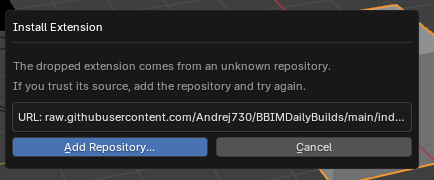
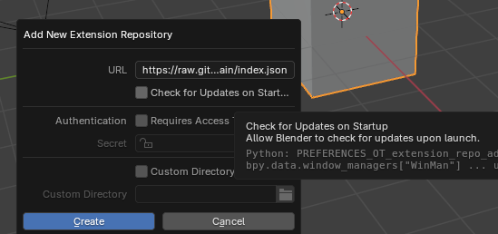
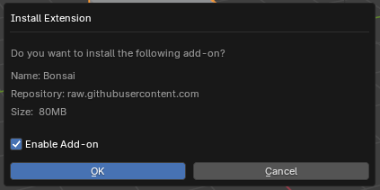
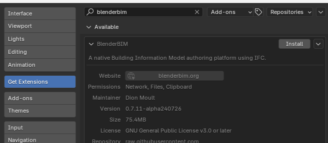
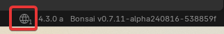
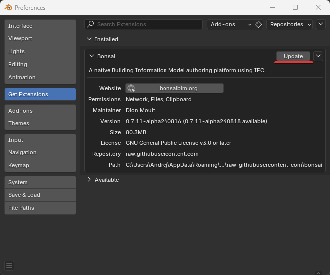
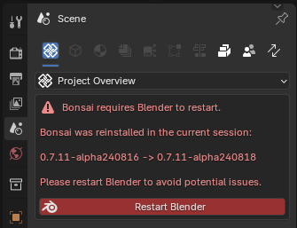

### Bonsai daily builds with in-blender autoupdate

Only supported for Bonsai with Python 3.11 (default Python version in Blender 4.2+) as Blender doesn't support separate builds for different Python versions.

1. Setup Bonsai Daily Builds Repository.

Drag'n'drop url for your platform from the table below to Blender (urls are in column "ID"), accept adding a new repository.
If you're on Mac with Apple Silicon (M1, M2, etc) use "macos-arm64" platform, if you're on Mac with Intel Silicon - "macos-x64".

During repository creation check "Check Updates On Startup" to get updates for daily Bonsai builds automatically.

Alternatively, repository can be created manually, without drag'n'drop:

- Open Blender Preferences -> "+" -> "Add Remote Remository". You'll see a window similar to the one above.

- Use as URL: `https://raw.githubusercontent.com/IfcOpenShell/bonsai_unstable_repo/main/index.json` and check auto-updates if you want them.

2. Install extension.

To install the Bonsai extension you can either drag'n'drop the same url again and install it:

Or you can search for "bonsai" in Extensions and Install it. Make sure selected extension have "raw.githubusercontent.com" as it's "Repository" (not "extensions.blender.org"), otherwise you'll install regular Bonsai version without daily updates.

3. Each time you start Blender it will check for updates and will show in the bottom toolbar a number of extensions ready to update:

Then you can either click on indicator or open "Get Extensions" tab in Preferences and you will be able to update BlederBIM using "Update" button.

Make sure to restart Blender after.

### Available daily builds

Blender Extensions

Blender Extension Listing:

Add\-on

---

| ID | Name | Description | Website | Blender Versions | Platforms | Size |
| --- | --- | --- | --- | --- | --- | --- |
| [bonsai\-0\.7\.11\-alpha240821](https://github.com/IfcOpenShell/IfcOpenShell/releases/download/bonsai-0.7.11-alpha240821/bonsai_py311-0.7.11-alpha240821-macos-x64.zip?repository=https://raw.githubusercontent.com/IfcOpenShell/bonsai_unstable_repo/main/index.json&blender_version_min=4.2.0&platforms=macos-x64) | Bonsai | A native Building Information Model authoring platform using IFC | [link](https://bonsaibim.org/) | 4\.2\.0 \- \~ | macos\-x64 | 99\.2MB |
| [bonsai\-0\.7\.11\-alpha240821](https://github.com/IfcOpenShell/IfcOpenShell/releases/download/bonsai-0.7.11-alpha240821/bonsai_py311-0.7.11-alpha240821-linux-x64.zip?repository=https://raw.githubusercontent.com/IfcOpenShell/bonsai_unstable_repo/main/index.json&blender_version_min=4.2.0&platforms=linux-x64) | Bonsai | A native Building Information Model authoring platform using IFC | [link](https://bonsaibim.org/) | 4\.2\.0 \- \~ | linux\-x64 | 105\.4MB |
| [bonsai\-0\.7\.11\-alpha240821](https://github.com/IfcOpenShell/IfcOpenShell/releases/download/bonsai-0.7.11-alpha240821/bonsai_py311-0.7.11-alpha240821-windows-x64.zip?repository=https://raw.githubusercontent.com/IfcOpenShell/bonsai_unstable_repo/main/index.json&blender_version_min=4.2.0&platforms=windows-x64) | Bonsai | A native Building Information Model authoring platform using IFC | [link](https://bonsaibim.org/) | 4\.2\.0 \- \~ | windows\-x64 | 80\.3MB |
| [bonsai\-0\.7\.11\-alpha240821](https://github.com/IfcOpenShell/IfcOpenShell/releases/download/bonsai-0.7.11-alpha240821/bonsai_py311-0.7.11-alpha240821-macos-arm64.zip?repository=https://raw.githubusercontent.com/IfcOpenShell/bonsai_unstable_repo/main/index.json&blender_version_min=4.2.0&platforms=macos-arm64) | Bonsai | A native Building Information Model authoring platform using IFC | [link](https://bonsaibim.org/) | 4\.2\.0 \- \~ | macos\-arm64 | 98\.5MB |

Built 2024\-08\-21, 12:28

